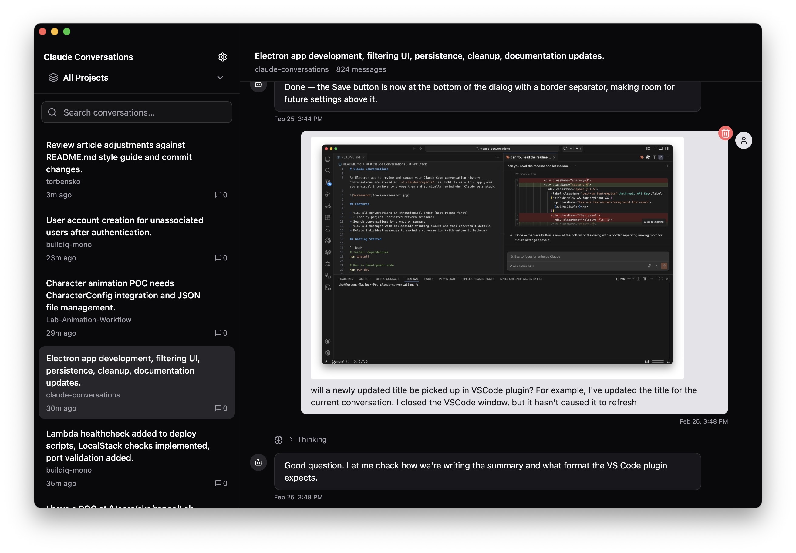

# Claude Conversations

Sometimes Claude gets so stuck that even a rewind can't recover the conversation. Rather than lose all that context, Claude Conversations lets you recover these sessions by browsing the raw conversation history and remove the messages that derailed things.

It reads the JSONL files stored at `~/.claude/projects/` and gives you a visual interface to explore, copy, and forcefully rewind your Claude Code conversations.



## Features

- **Browse & search** — filter by project, search by prompt or summary
- **Markdown rendering** — code blocks, tables, images, with collapsible thinking blocks and tool use details
- **Copy messages** — copies raw markdown to clipboard
- **Conversation rewind** — delete a message and everything after it to unstick Claude (with automatic backups)
- **AI summaries** — generate conversation titles with the Anthropic API
- **Index repair** — detect and fix stale or missing entries in VS Code's `sessions-index.json`

## Getting Started

```bash
# Install dependencies
npm install

# Run in development mode
npm run dev
```

## Build

```bash
# Package the app
npm run build

# Create distributable (.zip with .app inside)
npm run make
```

## Releasing

Push a version tag to trigger a GitHub Actions build and release:

```bash
git tag v0.1.0
git push origin v0.1.0
```

The workflow builds on `macos-latest` and attaches the `.zip` to a GitHub Release.

## Stack

- Electron Forge + Vite
- React 18 + TypeScript
- Shadcn UI (zinc/dark theme) + Tailwind CSS v4
